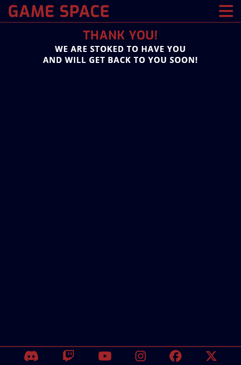
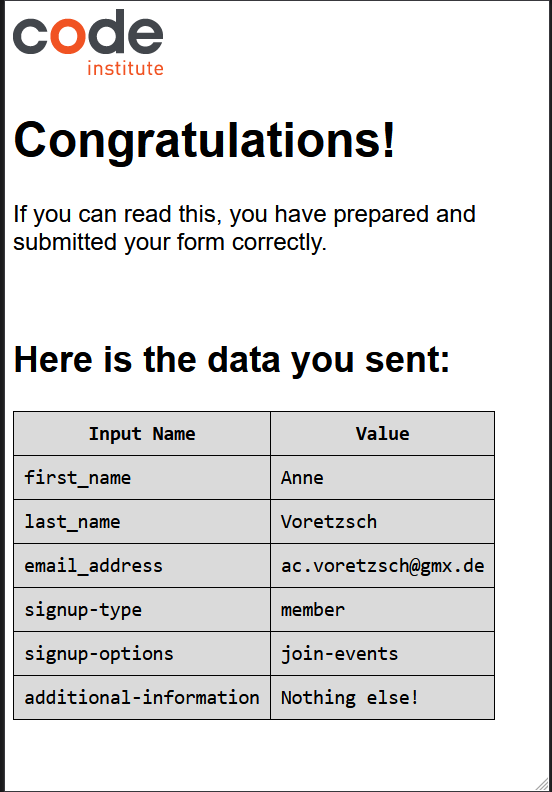
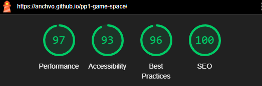

# Game Space
The Game Space website is the online presence of a gaming community that offers meeting spaces for gamers in three different locations in Germany. Members can meet at those locations and play games together, either by using provided equipment or bringing their own set-ups. Game Space also collaborates with Partners ans Sponsors like game studios, equipment manufacturers and game magazines to offer access to equipment and exclusive events. The members can also take part in the community by writing reviews, offering help and creating content like walkthroughs to help other members. 

Users will find all necessary information on the website: An introduction of the community, events, locations and contact information, offered resources and examples and a sign up form for new members or partners. The site is targeted towards gamers that want to meet and interact with other gamers and likeminded people.

The live link can be found here: [Game Space](https://anchvo.github.io/pp1-game-space/).

## UX

### User Demographic
This website is meant for:
  - Gamers from all backgrounds and platforms interested in joining a community
  - Game Content Creators interested in joining a community
  - Game Studios, Game Equipment manufactures and game magazines interested in collaborations
  - Sponsors interested in promoting a gaming community

### User Experience
New Users

  - __As a new User:__
      - I want to know more about Game Space and its community.
      - I want to find out more about events.
      - I want to find out more about community resources.
      - I want to sign up for events.
      - I want to sign up and become part of the community.
      - I want to build a partnership with Game Space.
      - I want to sponsor Game Space.

Existing Members

  - __As a Member:__
      - I want to be able to find upcoming events.
      - I want to sign up for events.
      - I want to be able to use the community resources.

### User Goals
    
  - Find information about gaming community
  - Sign up to events
  - Gain access to community resources
  - Join Community
  - Contact or visit community locations
  - Create partnership or sponsorship

## Design

### Typography

  - The fonts for the webpage were chosen to represent the content and gaming especially. Inspiration for the font families came from related pages about gaming or computers fround on [Typ.io](https://typ.io/). 
  - Two different fonts 'Open Sans' and 'Exo' were chosen to allow visual separation of content like titles and paragraphs. 
  - The fonts used were taken from [Google Fonts](https.//fonts.google.com).

### Color

  - The base colour of dark blue and red was chosen in accordance to the content of the page and to simulate the feeling of old gaming devices which often used similar colours.
  - The colour palette was created with [Coolers](https://coolors.co) to ensure that they would compliment each other and have a good contrast.
  

### Imagery 

  - Images has been chosen in relation to content and colour.
  - The images used on the website (all pages) are from the open source site [Pexels](https://pexels.com).

## Features

- __Navigation Bar__

  - Featured on all five visible pages and one hidden page, the full responsive navigation bar includes links to the Logo, Home page, Locations page, Events page, Resources page and Join Us page and is identical in each page to allow for easy navigation.
  - The navigation bar is located on the hidden Thank You page so the user can navigate back to the other pages, but is not included in the navbar itself because it is only visible when submitting the form on the Join Us page.
  - The navigation bar is located at the top of the page. It includes the name of the page as a big logo in the left corner. 
  - The other links are located on the left site either all visible in a row or hidden behind a icon that can be toggled to show the links.
  - The navigation bar  will allow the user to easily navigate from page to page across all devices without having to revert back to the previous page via the ‘back’ button. 

  

- __Home Page__

  - The Home page differs slightly from the other pages as it includes a hero section or header to welcome the user to the page. It also includes a short introduction of what Game Space does in a specific about section.

- __Hero Section / Header__

  - The hero section includes the hero image which is the first thing the user will see on the rest of the page and sits above the title. It shows people gaming together and is used to visually relate the content and theme of the page to the user.
  - The following title welcomes the user to the page. It also includes an icon of a gaming controller, visualising the theme again.
  - The title has an additional subititle that gives a short one sentence introduction about what Game Space is. This gives users who are unrelated to the subject a quick answer as to what they can expect from the page.

  

- __About Section__

  - The about section is separated by the header with a title that states clearly what kind of information the user will find.
  - The section is further devided into three visually separate parts, each describing a different aspect of what Game Space does.
  - Three images are used to enhance the information in each part and give visual references for each topic.
  - Each part includes links to further information on the other webpages, with arrow icons to clearly separate the links from text. This allows the users to quickly navigate to relating additional information on the subjects without trying to find it themselves.

  

- __Footer__

  - The footer is located in a fixed position on the bottom of the page.
  - It includes links to popular social networks that are hidden behind their respective logos via icons and will open to a new tab.
  - Featured on all five visible pages and one hidden page, the full responsive footer includes links to Discord, Twitch, YouTube, Instagram, Facebook and X and is identical in each page to allow for easy navigation.
  - The footer is valuable to the user as it encourages them to keep connected via social media.

  

- __Locations Page__

  - To be consistent in the overall design, the locations page welcomes the user with a title and subtitle, briefly stating what kind of information can be found on the page. 
  - This page will allow the user to see where exactly the different Game Space locations are by stating the address for each one and a link to view the location on Google Maps, which opens in a new tab.
  - It also provides contact details for each location (email and phone).
  - Additonally, the user can see the available equipment for each location which provides useful information for planning a visit.
  - Each location has an included picture to show what the user can expect from the location.

  

- __Events Page__

  - To be consistent in the overall design, the events page welcomes the user with a title and subtitle, briefly stating what kind of information can be found on the page. 
  - This page will allow the user to see what kinds of events are available, at which location they will be taking place and at what time they will start.
  - Each event has a link with an arrow icon that will allow the user to quickly navigate to the sign up form when they found an event they'd like to join.
  - The events are separated into two thematic sections that will allow the user to find specific events they are interested in more quickly.
  - The separation into two sections is further aided by using an image for each which visualise what kind of event the user can expect. 
  - This page will be updated as the events change to keep the user updated.

  

- __Resources Page__

  - To be consistent in the overall design, the resources page welcomes the user with a title and subtitle, briefly stating what kind of information can be found on the page. 
  - This page includes an image of a computer set-up that will allow the user to quickly realise what the content of the page is about. 
  - The rest of the content is separated into four parts, each with a relating title that will allow the user to find relevant information more quickly.
  - The content is supported by videos embedded for each part which will allow the user to quickly get an example for the included content.
    - The videos on the page have autoplay disabled to allow a better user experience.  

  

- __Join Us Page__

  - To be consistent in the overall design, the joinus page welcomes the user with a title and subtitle, briefly stating what kind of information can be found on the page. 
  - This page will allow the user to get signed up to Game Space and join the gaming community. The user will be able to specify if they are joining up as a member, a partner or a sponsor.
  - Additionally, the user will be able to choose from a list of activites they would like to take part in after joining.
  - For further information not included in the form, the user will be able to write further concerns into a textarea, allowing for specific questions to be asked.
  
  

- __Hidden Thank You Page__

  - To be consistent in the overall design, the thankyou page welcomes the user with a title and subtitle. In this case, both the title and subtitle reference to the successful submission of the signup form which will allow the user to get immediate feedback that their submission was received.

  

## Testing 

- The site was tested and confirmed to be working in different browsers: Firefox, Brave
- The site was tested on different screen sizes and confirmed to be responsive, good looking and functional via Devtools and the device toolbar.
- The site was tested for readability and easy understanding on all webpages.
- The links across all webpages were tested for functionality and confirmed to be opening either in the same document (internal navigation links) or in a new tab (external links).
- The videos were tested for playability and the disablement of the autoplay feature. 
- The form was tested for functionality: 
    - required entries in first name, last name, email address, and radio buttons fields.
    - the field for email will only accept a valid email address.
    - the submit button works.
    - the link to the hidden thank you page works and opens correctly.

- The submission of the form data was further tested and confirmed with the codeinstitute formdump page and respective code:
  
  

### Validator Testing 

 - __HTML__

    - No errors were returned when passing through the official [W3C validator](https://validator.w3.org/nu/?doc=https%3A%2F%2Fanchvo.github.io%2Fpp1-game-space%2F).

 - __CSS__

    - No errors were found when passing through the official [Jigsaw validator](https://jigsaw.w3.org/css-validator/validator?uri=https%3A%2F%2Fanchvo.github.io%2Fpp1-game-space%2Fassets%2Fcss%2Fstyle.css&profile=css3svg&usermedium=all&warning=1&vextwarning=&lang=en). 

 - __Accessibility__

    - Lighthouse Testing

      

### Unfixed Bugs

## Deployment

- __The website was deployed to GitHub pages via the following steps:__
  - Log into GitHub.
  - Go to the GitHub repository and navigate to the settings tab.
  - Under the code and automation menu, select the Pages tab.
  - In the branch menu, select the main branch and the /root folder in the folder menu.
  - Save your options and wait until your project is deployed.
  - The live link should show up at the top of the GitHub Pages site after a reload.
  - It can also be accessed via the repository page : 
      - On the repository page, choose the link to github-pages under the Deployment tab in the left navigation bar. 
      - The live link is at the top of the newly openened Deployments page. 

  The live link can be found here: [Game Space](https://anchvo.github.io/pp1-game-space/).

## Credits

### Disclaimer

- This page is a fictional creation and fitting content like images and media were chosen because of their thematic relevance and to best represent the idea. All images have been taken from open source websites. Videos were embedded and linked from their origin websites. The location pins for Google Maps were chosen at random and have no connection to real life places or people. 

### Help, Advice and Inspiration

- Martina Terlevic - my wonderful mentor. 

### Code

- The code for the navbar with toggle option was taken from the [Love Running](https://github.com/anchvo/love-running) project that was created during the course with [Code Institute](https://codeinstitute.net). 
- Trouble-Shooting for bugs was assissted by using [W3Schools](https://www.w3schools.com/) and [MDN Web Docs](https://developer.mozilla.org/en-US/).

### Content

- The icons used on the webpage and in the footer were taken from [Font Awesome](https://fontawesome.com/).

### Media

- The videos used and embedded were taken from [YouTube](https://youtube.com).